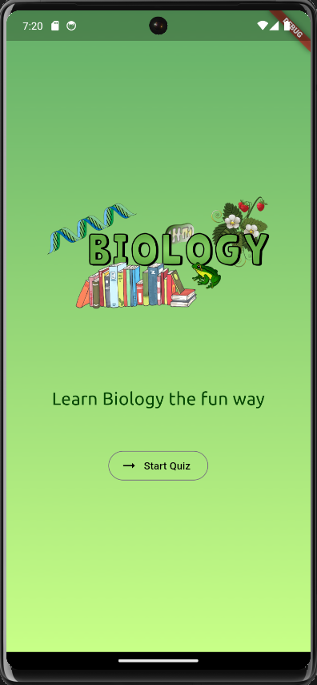
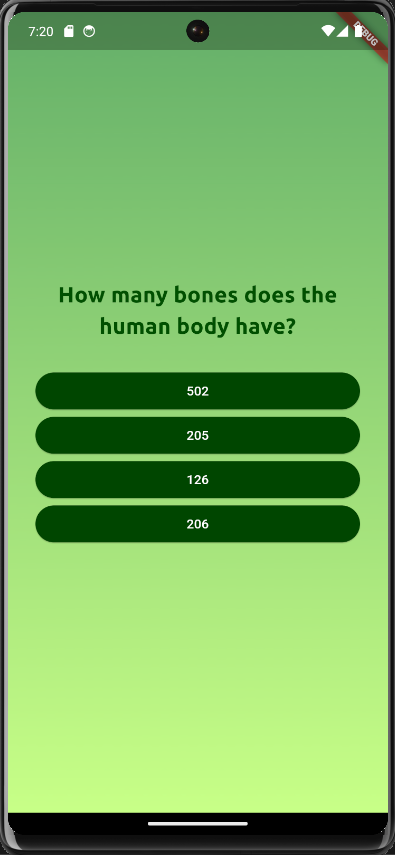
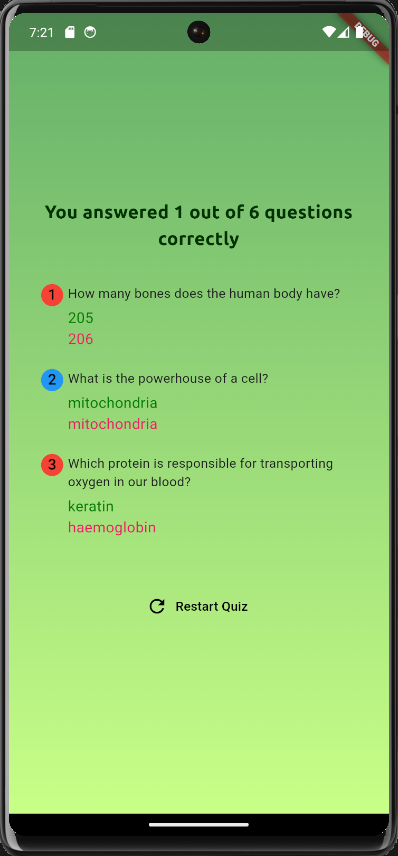

# quiz_app

The Flutter learning quiz is designed to offer users an engaging and educational experience. Users can actively participate by answering Biology-related questions presented in a question-and-answer format, as illustrated in the below images. Once users have completed the quiz, they are directed to a result screen where they can review their answers. The result screen provides valuable feedback, indicating which questions were answered correctly and offering insights into the correct answers for any questions that were answered incorrectly. This feedback loop creates an effective learning environment, allowing users to identify areas for improvement and reinforcing their understanding of Biology concepts.

Within the main Dart file, the `main` function serves a pivotal role as the main entry point for the application. This function is automatically executed by Dart when the app is launched. Subsequently, the `runApp` function is called, where the app's widget tree is passed as an argument. The widget tree is crucial in defining the structure and layout of the app, contributing to a seamless and visually appealing user interface.

A notable feature of the Biology learning quiz app is its adept handling of data transfer between widgets. This includes the transmission of more complex data, such as functions, demonstrating the versatility of Flutter in managing and manipulating data within the app. Additionally, the ability of widgets to accept functions as input values or arguments underscores Flutter's flexibility in facilitating dynamic interactions and functionality within the app. Overall, the app provides a comprehensive and interactive learning experience, encouraging users to continuously refine their knowledge through repeated quiz attempts.

Here are the screenshots of the app:

   

Here is the demo of the app:

[Watch the video](quiz_app_video.mp4)

(You have to download the video to watch it)
